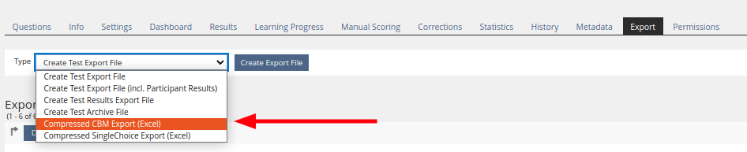

# TestExporter Plugin - CBMChoiceQuestionExport

## Requirements

                                                    
| Component         | Version(s)                                                                                           | Link                      |
|-------------------|------------------------------------------------------------------------------------------------------|---------------------------|
| PHP               |          | [PHP](https://php.net)    |
| ILIAS             |  to  | [ILIAS](https://ilias.de) |
| CBMChoiceQuestion |                                                         | [GitLab](https://gitlab.databay.de/Ilias-Plugins/CBMChoiceQuestion) |

<!-- TOC -->
* [TestExporter Plugin - CBMChoiceQuestionExport](#testexporter-plugin---cbmchoicequestionexport)
  * [Requirements](#requirements)
  * [Information](#information)
  * [Installation](#installation)
  * [Usage](#usage)
<!-- TOC -->

## Information

Requires the **CBMChoiceQuestion** plugin to be installed and active.  
Exports test data from the **CBMChoiceQuestion** plugin into an Excel file

## Installation

1. Clone this repository to **Customizing/global/plugins/Modules/Test/Export/CBMChoiceQuestionExport**
2. Install the Composer dependencies
   ```bash
   cd Customizing/global/plugins/Modules/Test/Export/CBMChoiceQuestionExport
   composer install --no-dev
   ```
   Developers **MUST** omit the `--no-dev` argument.
3. Login to ILIAS with an administrator account (e.g. root)
4. Select **Plugins** in **Extending ILIAS** inside the **Administration** main menu.
5. Search for the **CBMChoiceQuestionExport** plugin in the list of plugin and choose **Install** from the **Actions** drop-down.
6. Choose **Activate** from the **Actions** dropdown.

## Usage

1. A new export option is added to a tests Export tab

2. An Excel (.xls) file will be added to the table below.
3. The excel file will contain:
   - An overview sheet showing the average certainty & average correctness of the answers given for each test (cbm question only)
   - A sheet for each user with average certainty & average correctness over all questions  
     as well as the selected answer(s), correct answer(s) and selected certainty.